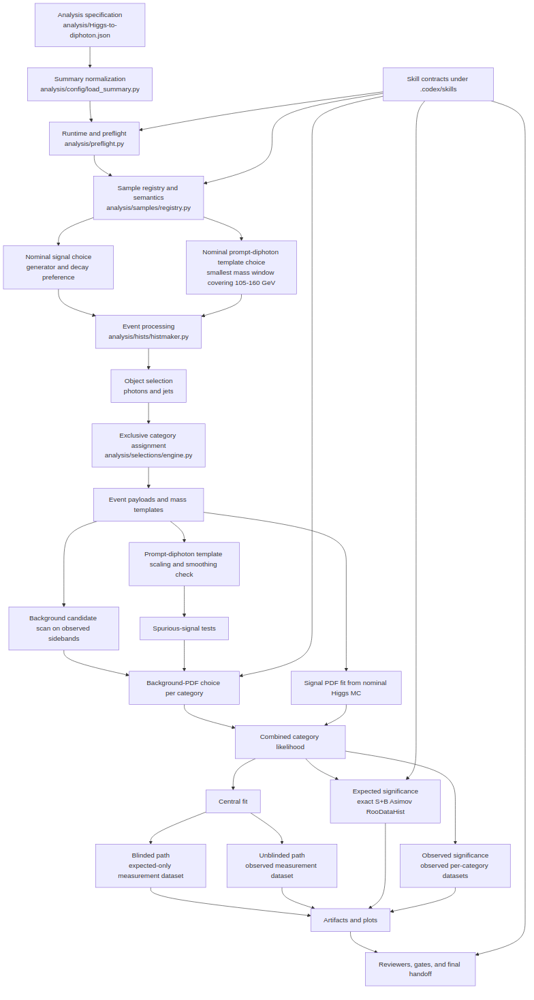

# Higgs-to-Diphoton Analysis Procedure

**Author:** Haichen Wang

**Affiliations:** Lawrence Berkeley National Laboratory (LBNL); University of California, Berkeley

**Date:** April 3, 2026

The analysis targets the process \(pp \to H \to \gamma\gamma\), in which the Higgs boson is sought as a narrow resonance in the diphoton invariant-mass spectrum above a large and smoothly falling continuum background. The measurement is therefore organized around the observable \(m_{\gamma\gamma}\), with the signal expected near 125 GeV and the background arising predominantly from prompt diphoton production, together with smaller reducible contributions from \(\gamma+\)jet, jet+jet, and \(Z\to ee\) events in which one or both reconstructed electromagnetic objects are identified as photons. The basic strategy is to isolate a clean diphoton sample, divide it into categories with different signal-to-background properties and mass resolutions, and then extract the Higgs signal through a simultaneous fit to the diphoton mass spectrum across all categories.

The event selection is designed to retain the characteristic \(H\to\gamma\gamma\) topology while suppressing the broad continuum background as much as possible without sacrificing sensitivity. Photon candidates are required to satisfy fiducial acceptance requirements, tight identification, and isolation criteria, together with transverse-momentum thresholds appropriate for a resonance search in the diphoton channel. Two selected photons are required in each event, and the diphoton candidate must satisfy the standard scaled transverse-momentum requirements \(p_T^{\gamma_1}/m_{\gamma\gamma}\ge 0.35\) and \(p_T^{\gamma_2}/m_{\gamma\gamma}\ge 0.25\). These conditions help suppress softer background configurations while preserving high efficiency for a Higgs boson with mass near 125 GeV. After the diphoton system is formed, only events in the mass range \(105\text{--}160\) GeV are retained. This broad window is chosen so that the smooth background can be constrained from data sidebands while still focusing the fit on the mass region relevant for the Higgs signal.

Jets are reconstructed in parallel and are used not to define the primary diphoton candidate, but to classify the event topology. In particular, events containing a dijet system with large invariant mass and substantial pseudorapidity separation can be enriched in vector-boson-fusion Higgs production, and this motivates a dedicated category for such events. More generally, the analysis uses both photon kinematics and limited jet information to partition the selected diphoton sample into subsets that differ in expected signal composition, background level, and mass resolution. This partition is central to the analysis design, because the selected events are not equally informative: some carry sharper mass resolution or better signal-to-background ratio than others, and a categorized fit preserves that information instead of averaging it away in a single inclusive spectrum.

The categorization scheme is a simplified five-category version of the ATLAS diphoton discovery strategy. In the original analysis, further subdivision based on photon conversion information was possible, but the corresponding variables are not available in the open-data sample used here. The simplified scheme preserves the main physical logic by using three features: whether the event has a VBF-like dijet topology, whether both photons are central in pseudorapidity, and whether the diphoton system has high or low \(p_{Tt}\). The five exclusive categories are therefore: a two-jet VBF-enriched category; central low-\(p_{Tt}\); central high-\(p_{Tt}\); rest low-\(p_{Tt}\); and rest high-\(p_{Tt}\). The VBF-enriched category requires at least two jets with \(|\eta|<4.5\), \(m_{jj}>400\) GeV, and \(\Delta\eta_{jj}>2.8\). Among the remaining events, those with both photons satisfying \(|\eta|<0.75\) are assigned to the central branch, while all others enter the rest branch. Each of these branches is then divided at \(p_{Tt}=60\) GeV into low- and high-\(p_{Tt}\) regions. The assignment is hierarchical and mutually exclusive, so each event enters exactly one category.

This category structure is introduced because different event classes contribute differently to the sensitivity of the search. Events with central photons generally have better diphoton mass resolution, so the Higgs signal appears as a narrower peak. Events in the two-jet category are enriched in VBF production and often have more favorable signal-to-background characteristics. Events with higher \(p_{Tt}\) correspond to a more boosted diphoton system and can have a different mixture of production modes and background composition from lower-\(p_{Tt}\) events. If all selected events were merged into a single inclusive sample, these differences would be washed out, and the cleaner or more distinctive events would be diluted by the broader and more background-dominated ones. By fitting the categories separately but simultaneously, the analysis allows each subset of events to contribute according to its own mass resolution and signal purity while still testing one common Higgs-boson hypothesis.

The signal is extracted from the diphoton invariant-mass distribution in each category. The Higgs contribution is modeled as a narrow resonant peak using signal simulation, while the continuum background is represented by a smooth analytic function fit directly to the observed diphoton mass spectrum in each category. The dominant irreducible background is prompt diphoton production, and the reducible backgrounds from \(\gamma+\)jet, jet+jet, and \(Z\to ee\) misidentification contribute to the same smoothly falling mass spectrum rather than producing narrow resonant structures at the Higgs mass. The fit therefore relies on the contrast between a localized Higgs peak and a broad nonresonant background.

A further important part of the procedure is the selection of the continuum-background probability density in each category. What is chosen separately from one category to another is the smooth background shape. The signal shape is treated differently: it is taken from Higgs simulation, modeled as a narrow resonance around 125 GeV, and then held fixed when extracting the signal strength. The freedom in the fit therefore lies on the background side. This choice is made category by category because the event classes are physically different. A VBF-enriched category need not have exactly the same continuum composition or mass-spectrum curvature as a more inclusive low-\(p_{Tt}\) category, so there is no reason to impose a single common background parameterization across all regions. Instead, each category is allowed to have its own smooth background description, chosen to match its own observed mass spectrum.

The first anchor for this choice is the observed data outside the Higgs signal window. These sidebands determine the smooth behavior that the background function must reproduce in the real data. However, sideband fit quality alone is not sufficient, because a function may describe the sidebands well and yet induce an artificial excess when interpolated through the signal region. To guard against this possibility, the analysis also uses a prompt-diphoton background template as a signal-free reference. That template is normalized to the observed sidebands, and if its statistical precision is limited it may be smoothed before use. The purpose of this auxiliary template is not to replace the data-driven background determination, but to test whether a candidate smooth function can bias the signal extraction by imitating a narrow Higgs-like peak.

A small set of candidate analytic background functions is then considered in each category. For each candidate, the analysis asks two related questions. First, does the function describe the observed sidebands adequately, without introducing unnecessary complexity? Second, when that same function is fit together with a signal component to a background-only template, how much fake signal does it induce? This second criterion is the more important physics test, because it measures directly whether the background model can manufacture a Higgs-like contribution where none exists. In other words, the background-PDF choice is not based simply on goodness of fit, but on the requirement that the continuum description remain smooth enough not to mimic the signal being searched for.

The selection rule is therefore to choose, in each category, the simplest smooth background shape that still keeps the spurious signal acceptably small. If more than one candidate satisfies that requirement, the less flexible function is preferred. If none is fully satisfactory, the function with the smallest induced fake signal is retained, while the category is recognized as methodologically limited. In this sense, the chosen background PDF in each category is the least flexible smooth description of the continuum that both reproduces the sideband data and avoids falsely generating a narrow Higgs signal near 125 GeV. This procedure is essential to the credibility of the diphoton analysis, because the signal being sought is itself a small localized excess on top of a large smooth background, and any background model that is too adaptable can artificially enhance or suppress that excess.

In statistical terms, the categorized analysis is implemented as a simultaneous likelihood fit across the five categories. In a given category \(c\), the diphoton mass distribution is described by the sum of a signal term and a background term,
\[
f_c(m_{\gamma\gamma})=\mu\, s_c\, S_c(m_{\gamma\gamma})+b_c\, B_c(m_{\gamma\gamma}),
\]
where \(S_c\) is the fixed signal shape in that category, \(B_c\) is the selected smooth background shape, \(s_c\) is the expected signal yield, \(b_c\) is the background normalization, and \(\mu\) is the common signal-strength parameter. The crucial point is that \(\mu\) is shared by all categories, so the signal contributions in the five categories are not fitted independently; rather, they are tied together by the hypothesis of a single Higgs boson contributing coherently across all event classes. The full likelihood is then the product of the category likelihoods, or equivalently the total log-likelihood is the sum of the individual category log-likelihoods. A categorized analysis is therefore not a set of separate measurements averaged at the end, but a single combined fit in which each category contributes according to its statistical power.

The expected discovery significance is evaluated in the blinded analysis. In that procedure, the observed data in the \(120\text{--}130\) GeV signal window are intentionally hidden, so they cannot be used to determine the background model in the region where the Higgs signal would appear. The continuum background must therefore first be constrained using only the observed sidebands, \(105\text{--}120\) GeV and \(130\text{--}160\) GeV. This is the information available from data under blinding: the smooth continuum behavior is learned from the sidebands, while the signal model itself comes from simulation. Once the background has been determined in this way, it is combined with the fixed signal model to define a signal-plus-background hypothesis with \(\mu=1\), corresponding to a Standard-Model-sized Higgs signal. From that full model one constructs an Asimov dataset over the entire fit range \(105\text{--}160\) GeV, including the blinded signal window. This is allowed because the Asimov dataset is not observed data; it is the model expectation, built category by category by filling each mass bin with the exact expected signal-plus-background yield and therefore contains no statistical fluctuations.

The expected significance is then obtained by fitting this same Asimov dataset in two ways. In the first fit, the signal strength \(\mu\) is allowed to float freely. Since the Asimov data were generated from a signal-plus-background model with \(\mu=1\), this unconstrained fit should recover a best-fit value \(\hat{\mu}\approx 1\). That is an important self-consistency condition: fitting signal-plus-background Asimov data with the same signal-plus-background model should return the injected signal strength. In the second fit, \(\mu\) is fixed to zero, so the model is forced into the background-only hypothesis while the remaining background-related parameters are allowed to adjust. This asks how well a smooth background alone can imitate the same spectrum that was actually generated with a Higgs signal included. The difference between the two fits defines the discovery test statistic,
\[
q_0 = 2\left(NLL_{\mu=0}-NLL_{\mathrm{free}}\right),
\]
with negative values clipped to zero, and the median expected discovery significance is then
\[
Z_{\mathrm{exp}}=\sqrt{q_0}.
\]
Thus the logic of the blinded expected-significance procedure is to learn the continuum from observed sidebands only, generate a signal-plus-background Asimov spectrum across the full mass range, and then compare the free-\(\mu\) and \(\mu=0\) fits to that model-generated dataset.

The observed significance is conceptually different. It is obtained only after explicit unblinding, and it is done by fitting the real observed data over the full diphoton mass spectrum in the fit range. In that case the \(120\text{--}130\) GeV window is no longer hidden, so the fit uses the actual selected events across the entire \(105\text{--}160\) GeV interval, category by category. Again two fits are performed to the same dataset: an unconstrained fit in which \(\mu\) is allowed to float, and a conditional background-only fit with \(\mu=0\). Their likelihood difference defines the observed \(q_0\), and the observed significance is obtained as
\[
Z_{\mathrm{obs}}=\sqrt{q_0},
\]
with the usual one-sided discovery convention. The distinction is therefore clear: the expected significance comes from a blinded, model-generated signal-plus-background Asimov spectrum, whereas the observed significance comes from the real unblinded diphoton mass spectrum itself.

This is precisely why categorization improves sensitivity in the diphoton channel. A category with better mass resolution produces a sharper signal peak and therefore stronger discrimination between the signal-plus-background and background-only hypotheses. A category with a higher signal-to-background ratio exerts a larger pull on the common signal strength. Other categories may be less pure but still contribute useful information through their event counts and mass shapes. The simultaneous fit naturally combines all of these contributions. In effect, the analysis replaces one inclusive diphoton mass spectrum with several mass spectra of differing quality and topology, and then fits them together under a common Higgs signal hypothesis. That is the central statistical advantage of the categorized \(H\to\gamma\gamma\) analysis.

The final inference is based on the profile-likelihood ratio comparing the background-only and signal-plus-background hypotheses. In each category, the diphoton mass spectrum is fit with a signal-plus-background model, with the signal represented by a fixed narrow resonance shape and the background represented by the selected smooth continuum PDF for that category. The five categories are then combined through the shared signal-strength parameter \(\mu\). The role of the event selection is to define a clean and well-measured diphoton sample. The role of the categorization is to preserve differences in event topology, signal purity, and mass resolution that materially affect the discovery sensitivity. The role of the background-function selection is to ensure that the smooth continuum is described accurately enough to support the fit, but not so flexibly that it can fabricate a Higgs-like excess. The role of the expected-significance construction is to evaluate, under blinding, how strongly a Standard-Model-sized Higgs signal would appear on average, while the observed-significance calculation tests the same hypothesis directly on the real unblinded data. Together, these ingredients convert an inclusive sample of diphoton events into a structured resonance-search analysis optimized for the extraction of a small Higgs boson signal above a large smooth background.

# Technical Appendix: Higgs-to-Diphoton Analysis Reconstruction-Level Description

## Status And Intent

This document is a concise technical description of the Higgs-to-diphoton analysis implemented in this repository. It is written to the same level of operational detail as the `.codex/skills` contracts: a reader should be able to reconstruct the analysis logic, stage ordering, statistical interpretation, and artifact expectations by reading this file together with the repository contents. It is not a run log and it is not a high-level summary.

The source of truth for the procedure is split across two connected layers:

- the skill contracts under `.codex/skills/`, which define the required stage order, reviewer expectations, and handoff conditions,
- the executable implementation under `analysis/`, which realizes those contracts in code.

This note follows the skill-governed stage order and points to the implementation that executes each step.

## Governing Sources

The analysis is governed by the following repository sources.

- Analysis specification: `analysis/Higgs-to-diphoton.json`
- Summary normalization and runtime defaults: `analysis/config/load_summary.py`
- End-to-end orchestration: `analysis/pipeline.py`
- Command-line entrypoint: `analysis/cli.py`
- Preflight and smoke-policy checks: `analysis/preflight.py`
- Sample discovery and semantic role assignment: `analysis/samples/registry.py`, `analysis/samples/strategy.py`
- Object building and event processing: `analysis/objects/photons.py`, `analysis/objects/jets.py`, `analysis/hists/histmaker.py`
- Category assignment and partitions: `analysis/selections/engine.py`, `analysis/selections/partitioning.py`
- Statistical models and fitting: `analysis/stats/models.py`, `analysis/stats/fit.py`, `analysis/stats/significance.py`
- Systematics placeholder layer: `analysis/stats/systematics.py`
- Reporting, reviewers, and gates: `analysis/report/artifacts.py`, `analysis/report/reviews.py`, `analysis/report/make_report.py`

The analysis-governance layer that defines what the pipeline is required to do is represented primarily by:

- `.codex/skills/hep-analysis-meta-pipeline/`
- `.codex/skills/hep-analysis-pipelines/`
- `.codex/skills/hep-analysis-reviewers/`

Within those skills, the most relevant contracts for reconstructing the analysis are the meta-pipeline stage description, the sample-and-template semantics pipeline, the fit-and-significance wrapper, the statistical-readiness reviewer, the reporting-and-handoff pipeline, the logging contract, and the artifact matrix.

## Problem Definition

The physics target is the process \(pp \to H \to \gamma\gamma\). The observable used for the final signal extraction is the diphoton invariant mass \(m_{gg}\). The signal hypothesis is a narrow resonance near \(125\,\mathrm{GeV}\). The dominant background is a smooth continuum, composed physically of prompt diphoton production plus additional fake-photon and electron-fake components in data. The analysis therefore separates two modeling problems:

- the signal is modeled as a localized narrow peak using nominal Higgs MC,
- the continuum background is modeled analytically from observed-data sidebands, while prompt-diphoton MC is reserved as the nominal template source for smoothing and spurious-signal studies.

The analysis increases sensitivity by partitioning selected events into five exclusive categories and fitting them simultaneously with a shared signal-strength parameter \(\mu\).

## Required Inputs

The pipeline expects CERN Open Data ROOT files arranged under `input-data/` with the conventional split:

- `input-data/data/` for observed data ROOT files,
- `input-data/MC/` for Monte Carlo ROOT files.

The event tree name is `analysis`. The pipeline reads the sample metadata encoded in filenames and ROOT contents, then assigns each file a semantic analysis role. Sample selection is handled by the pipeline itself; the user is not expected to pre-curate signal and background subsets by hand.

## Normalized Analysis Contract

The human-authored specification file is not executed directly. It is first normalized by `analysis/config/load_summary.py`, which injects the runtime defaults that make the rest of the pipeline deterministic.

The normalized contract includes the following key defaults.

- Target and central luminosity: \(36.1\,\mathrm{fb}^{-1}\)
- Fit mass range: \(105\text{--}160\,\mathrm{GeV}\)
- Signal window: \(120\text{--}130\,\mathrm{GeV}\)
- Sidebands: \(105\text{--}120\,\mathrm{GeV}\) and \(130\text{--}160\,\mathrm{GeV}\)
- Histogram bin width for mass templates: \(1\,\mathrm{GeV}\)
- Photon preselection thresholds:
  - \(p_T > 25\,\mathrm{GeV}\)
  - \(|\eta| < 2.37\)
  - barrel-endcap crack veto \(1.37 < |\eta| < 1.52\)
  - tight identification
  - tight isolation
  - lead-photon \(p_T / m_{gg} \ge 0.35\)
  - sublead-photon \(p_T / m_{gg} \ge 0.25\)
- Jet selection thresholds:
  - \(p_T > 25\,\mathrm{GeV}\)
  - \(|\eta| < 4.5\)
- Background-function candidates:
  - exponential
  - bernstein2
  - bernstein3
- Smoothing policy:
  - required when prompt-diphoton MC effective luminosity is below threshold,
  - method TH1::Smooth,
  - scope `prompt_diphoton_nominal_templates`
- Default blinding:
  - signal-window plotting masked,
  - observed significance not allowed,
  - central fit does not use observed data.

Category identifiers from the JSON specification are also canonicalized at this stage. In particular, `SR_2JET` is mapped to `two_jet_vbf_enriched`.

## Pipeline Stage Order

The stage order implemented in `analysis/pipeline.py` follows the same sequence required by the meta-pipeline skill.

1. Read and normalize the analysis specification.
2. Establish runtime metadata and run preflight checks.
3. Build sample metadata and the semantic sample registry.
4. Derive sample-strategy artifacts for nominal signal and nominal prompt-diphoton template choice.
5. Process selected samples into event payloads, yields, and mass histograms.
6. Build category partitions and template semantics artifacts.
7. Run the central measurement fit.
8. Build the systematics placeholder bundle.
9. Compute significance.
10. Generate plots, report artifacts, reviewer judgments, gates, and final handoff state.

This ordering matters. The later stages are not allowed to guess at sample meaning, blinding state, or modeling choices; those have to be established explicitly earlier in the chain.

## Sample Semantics

### Registry Construction

The sample registry is built in `analysis/samples/registry.py`. The registry converts raw files into analysis records with physics-role semantics. That step is necessary because the fit and reviewer layers do not consume filenames directly; they consume roles such as observed data, nominal signal, and prompt-diphoton spurious-signal template source.

The registry logic performs the following tasks.

- Discover data files under `input-data/data` and label them as observed data.
- Discover MC files under `input-data/MC` and parse filename descriptors to infer process identity, generator, and decay mode.
- Compute signed generator-weight sums from the ROOT files.
- Build normalization factors from cross section, `k`-factor, filter efficiency, luminosity, and the signed sum of MC weights.
- Preserve the central event-weight expression used downstream:
  `w_norm * mcWeight * ScaleFactor_PILEUP * ScaleFactor_PHOTON * ScaleFactor_JVT`

### Nominal Signal Choice

The pipeline chooses nominal signal samples by process-key matching and generator preference. The goal is not to use every signal-like file in the final measurement, but to select the central signal representation that will define the signal shape and expected yield in each category.

### Nominal Prompt-Diphoton Template Choice

The prompt-diphoton MC sample used for the spurious-signal study is chosen by mass-window coverage. The pipeline selects the smallest available generated mass window that still fully covers the \(105\text{--}160\,\mathrm{GeV}\) fit domain. This turns prompt-diphoton MC into a dedicated template source for smoothing diagnostics and spurious-signal testing rather than a substitute for the observed continuum background itself.

This distinction is critical:

- observed sideband data define the continuum-background fit target,
- prompt-diphoton MC defines the nominal template against which background-function bias is tested.

## Object Definition And Event Reconstruction

### Photon Objects

Photon building is implemented in `analysis/objects/photons.py` and used by `analysis/hists/histmaker.py`. Each event is searched for photons satisfying the normalized runtime contract. The selected photons must pass kinematic, acceptance, crack-veto, identification, and isolation requirements. At least two selected photons are required.

The highest-priority diphoton candidate is then used to build the diphoton system. The analysis computes at least the following event-level quantities per selected event:

- diphoton invariant mass \(m_{gg}\),
- diphoton transverse-thrust-like variable \(p_{Tt}\),
- diphoton opening \(\Delta R\),
- lead and sublead photon \(p_T\),
- lead and sublead photon \(\eta\).

The final diphoton candidate must satisfy the fractional \(p_T / m_{gg}\) requirements:

- lead photon \(p_T / m_{gg} \ge 0.35\),
- sublead photon \(p_T / m_{gg} \ge 0.25\).

Only events in the fit range \(105\text{--}160\,\mathrm{GeV}\) are retained for the analysis products.

### Jet Objects

Jets are built in `analysis/objects/jets.py` using the normalized jet thresholds. The selected-jet collection is used only after diphoton selection, for category assignment. For each retained event, the pipeline records at least:

- jet multiplicity,
- dijet invariant mass \(m_{jj}\),
- dijet pseudorapidity separation \(\Delta \eta_{jj}\).

## Event Selection

The event processing stage is implemented in `analysis/hists/histmaker.py`. It applies the analysis logic in a strict sequence and records cutflow information. Conceptually, the event selection is:

1. start from all events,
2. require at least two selected photons,
3. require the diphoton \(p_T / m_{gg}\) fractions,
4. require \(m_{gg}\) inside \(105\text{--}160\,\mathrm{GeV}\),
5. assign the event to exactly one analysis category.

The cutflow labels stored by the pipeline are:

- `all_events`
- `two_photons`
- `pt_fraction`
- `mass_window`
- `categorized`

This means the selected analysis sample is not just "two photons near the Higgs mass". It is the subset of events that pass the full object definition, kinematic structure, fit-domain restriction, and exclusive category partition.

## Category Partition

Category assignment is implemented in `analysis/selections/engine.py`. The analysis defines five mutually exclusive signal-region categories:

- `two_jet_vbf_enriched`
- `central_low_ptt`
- `central_high_ptt`
- `rest_low_ptt`
- `rest_high_ptt`

The category rules are:

- `two_jet_vbf_enriched`:
  - at least two selected jets,
  - \(m_{jj} > 400\,\mathrm{GeV}\),
  - \(\Delta \eta_{jj} > 2.8\)
- central photon topology:
  - both selected photons satisfy \(|\eta| < 0.75\)
- high-\(p_{Tt}\):
  - \(p_{Tt} \ge 60\,\mathrm{GeV}\)

The assignment order is hierarchical.

1. First test the VBF-enriched category.
2. For events not assigned to VBF, test whether both photons are central.
3. Split the central events into `central_low_ptt` and `central_high_ptt`.
4. Split the remaining events into `rest_low_ptt` and `rest_high_ptt`.

The partitioning layer in `analysis/selections/partitioning.py` turns those categories into an explicit machine-readable partition description, including the blinding status of the signal window in displayed data.

## Event Products And Templates

The histogramming stage stores both event-level and binned products. This is important because the analysis uses different statistical representations in different places.

For each active category, the processing output includes event arrays such as:

- \(m_{gg}\)
- \(p_{Tt}\)
- \(\Delta R\)
- lead and sublead photon kinematics
- jet multiplicity and dijet observables
- signal-window and sideband flags
- event and run identifiers

The same stage also builds binned mass histograms over the \(105\text{--}160\,\mathrm{GeV}\) range. These histograms are later used for:

- display products,
- sideband-data summaries,
- prompt-diphoton template smoothing studies,
- exact binned Asimov construction for expected significance.

## Blinding Policy

The default runtime contract is blinded. In blinded mode:

- plots hide observed data in the \(120\text{--}130\,\mathrm{GeV}\) signal window,
- observed significance is not computed,
- the central fit uses expected data derived from the statistical model rather than the observed signal-window data.

Explicit unblinding is a runtime override, applied in `analysis/pipeline.py` when the user requests the observed result. In that mode:

- signal-window plotting is unmasked,
- observed significance is allowed,
- the central fit uses observed data.

Once explicit unblinding is performed, the observed-significance calculation is no longer based on sidebands alone or on a model-generated expectation. It is obtained by fitting the real selected diphoton mass spectrum across the full \(105\text{--}160\,\mathrm{GeV}\) fit range, including the previously hidden \(120\text{--}130\,\mathrm{GeV}\) signal window.

The blinding policy is not cosmetic. It changes both what can be plotted and what dataset is legally used by the measurement and significance stages.

## Background Modeling

### Role Of Observed Data Versus Prompt-Diphoton MC

The continuum background model is determined from observed sideband data. Prompt-diphoton MC is not used as the nominal continuum fit target. Instead, it serves as the nominal template source for smoothing decisions and spurious-signal testing.

This is a deliberate separation of responsibilities:

- observed data define the background shape to be fitted in the sidebands,
- prompt-diphoton MC defines a signal-free template on which background-function bias is measured.

### Candidate Analytic Functions

The analytic background candidates are defined through the normalized runtime contract and materialized in `analysis/stats/models.py` and `analysis/stats/fit.py`. The standard candidate set is:

- exponential,
- Bernstein polynomial of order 2,
- Bernstein polynomial of order 3.

Each active category is scanned independently.

### Template Scaling And Smoothing Gate

Before the spurious-signal test is performed, the prompt-diphoton nominal template is scaled to the observed data in the sidebands. This aligns the template normalization with the observed continuum rate in the control region used for background determination.

The effective luminosity of the prompt-diphoton MC sample is checked against a threshold of ten times the target luminosity. If the prompt sample is too small in effective luminosity, the smoothing policy becomes mandatory. In the current implementation the required smoothing method is `TH1::Smooth`.

The smoothing decision and its provenance are recorded as explicit artifacts. This means the background-function choice is auditable against the statistical quality of the template on which the spurious-signal test is based.

### Background-PDF Scan And Selection

The background scan is implemented in `_scan_background_models(...)` inside `analysis/stats/fit.py`. For each category, the procedure is:

1. build the observed sideband dataset,
2. build the scaled prompt-diphoton nominal template,
3. optionally smooth that template if the effective-luminosity policy requires it,
4. instantiate each candidate background function,
5. fit each candidate to the observed sideband data,
6. compute the information criterion
   \(AIC = 2\,n_{\mathrm{par}} + 2\,\mathrm{minNll}\),
7. perform a spurious-signal test by fitting the template with background-plus-signal,
8. compute the spurious-signal metric
   \(r_{\mathrm{spur}} = |N_{\mathrm{spur}}| / \sigma_{N_{\mathrm{sig}}}\),
9. determine whether the candidate passes the target criterion
   \(r_{\mathrm{spur}} < 0.2\),
10. choose the background function using the scan policy.

The selection policy is not "pick the smallest AIC". It is more restrictive:

- if one or more candidates pass the spurious-signal threshold, choose the lowest-complexity passing model; break ties using smaller \(|N_{\mathrm{spur}}|\) and then better \(AIC\),
- if no candidate passes, choose the smallest \(r_{\mathrm{spur}}\) and mark the outcome as capped noncompliance.

This is the central background-model-selection rule of the analysis. The procedure is applied category by category, and the resulting choice is frozen into the final likelihood.

## Signal Modeling

The signal model is built from nominal signal MC in `analysis/stats/fit.py`. For each category, the nominal signal events that passed the analysis selection are fit with a Crystal Ball shape. The resulting shape parameters define the signal PDF for that category. Those signal-shape parameters are then fixed for downstream inference.

The signal normalization entering the final likelihood is represented by a category-dependent constant expected yield multiplied by a single shared parameter of interest:

\[
N_{\mathrm{sig},c} = \mu\, s_c
\]

where:

- \(\mu\) is the shared signal-strength parameter across all categories,
- \(s_c\) is the fitted or derived nominal signal yield for that category.

This means the categories do not have independent signal strengths. The statistical combination is explicitly a shared-\(\mu\) combination.

## Final Likelihood Construction

The final model for each active category is:

- a fixed signal PDF,
- a selected analytic background PDF with parameters initialized from the sideband fit,
- a floating background normalization \(N_{\mathrm{bkg},c}\),
- a shared signal strength \(\mu\).

Conceptually, the expected mass density in category \(c\) is:

\[
f_c(m) = N_{\mathrm{bkg},c}\, B_c(m) + \mu\, s_c\, S_c(m)
\]

where:

- \(B_c(m)\) is the chosen analytic continuum background PDF,
- \(S_c(m)\) is the fixed signal PDF,
- \(N_{\mathrm{bkg},c}\) floats independently for each category,
- \(\mu\) is shared across all categories.

`analysis/stats/fit.py` also constructs a `RooSimultaneous` object, but the actual minimization path used by the repaired pipeline is a summed per-category NLL backend rather than direct `RooSimultaneous.fitTo(...)` for the key measurement and significance stages.

## Central Measurement Fit

The central fit is run in `run_fit(...)` inside `analysis/stats/fit.py`. Only categories with all required ingredients are activated:

- observed data,
- nominal signal model inputs,
- prompt-diphoton template inputs for the spurious-signal workflow.

The central-fit dataset depends on blinding mode.

### Blinded Mode

In the default blinded mode, the central fit is not allowed to use the observed signal-window data. The measurement dataset is therefore an expected dataset derived from the model, and the fit is performed with an exact per-category binned NLL backend. In this mode the physical lower bound \(\mu \ge 0\) is enforced.

### Explicitly Unblinded Mode

In explicitly unblinded mode, the central fit uses the observed per-category event samples. The fit backend is a summed per-category unbinned NLL minimized with Minuit2. In this mode the signal-strength lower bound is relaxed to allow negative fitted values if the data fluctuate below the nominal signal hypothesis.

The output of the central measurement stage includes at least:

- fitted \(\mu\) and uncertainty,
- category-level model choices,
- fit backend provenance,
- measurement-dataset provenance,
- model plot payloads,
- spurious-signal artifacts,
- background-template selection and smoothing artifacts.

## Expected Significance

Expected significance is computed in `analysis/stats/significance.py` using a signal-plus-background Asimov construction. This is the default significance result produced in blinded mode.

Because this is a blinded analysis, the observed data in the \(120\text{--}130\,\mathrm{GeV}\) signal window are not available for determining the background in the region where the Higgs peak would appear. The continuum background must therefore first be constrained from the observed sidebands only, namely \(105\text{--}120\,\mathrm{GeV}\) and \(130\text{--}160\,\mathrm{GeV}\). Physically, this means the data are allowed to determine the smooth background behavior outside the signal region, while the signal contribution itself remains hidden.

Once that blinded background description has been established, it is combined with the signal model from simulation to define a signal-plus-background hypothesis with \(\mu = 1\). Here \(\mu = 1\) means the nominal Higgs signal strength. From that full model, one constructs an Asimov dataset across the entire \(105\text{--}160\,\mathrm{GeV}\) fit range, including the blinded \(120\text{--}130\,\mathrm{GeV}\) window. This is allowed because the Asimov dataset is not observed data. It is the model expectation. In each category and in each mass bin, the bin content is set equal to the expected yield from the signal-plus-background model, so the Asimov spectrum represents the median experiment with no statistical fluctuations.

The repaired implementation follows the correct exact-binned procedure:

1. restore the category background parameter snapshot from the sideband-constrained configuration,
2. set the generation hypothesis to \(\mu = 1\),
3. build exact per-bin Asimov histograms from the full signal-plus-background model over \(105\text{--}160\,\mathrm{GeV}\),
4. use those exact expected bin counts as the category Asimov data,
5. construct the combined binned likelihood for all categories,
6. run an unconditional fit in which \(\mu\) is free,
7. run a conditional fit in which \(\mu = 0\),
8. form the discovery test statistic
   \(q_0 = \max\!\left(2\,(NLL_{\mu=0} - NLL_{\mathrm{free}}), 0\right)\),
9. report the median expected discovery significance as
   \(Z = \sqrt{q_0}\).

The two fits have different meanings. The free-\(\mu\) fit asks which signal strength best describes the signal-plus-background Asimov data once the nuisance parameters are profiled. Because the Asimov data were built from a model with \(\mu = 1\), that fit should return \(\hat{\mu} \approx 1\). The \(\mu = 0\) fit asks how well a background-only hypothesis can reproduce the same median signal-plus-background spectrum once the nuisance parameters are allowed to adjust. The expected significance comes from the loss in likelihood when the signal component is forced away.

The Asimov self-fit is therefore an important consistency check:

- the free fit to S+B Asimov data should return \(\hat{\mu} \approx 1\),
- the resulting expected significance should be strictly positive.

This is why the exact per-bin Asimov construction matters. If the Asimov data are not built in a way that matches the likelihood used in the fit, the fit can fail to recover the injected \(\mu = 1\) hypothesis and the expected significance can become unphysical.

## Observed Significance

Observed significance is only legal after explicit unblinding. When unblinding is enabled, `analysis/stats/significance.py` computes the observed discovery test from the actual selected events in each category.

The repaired observed-significance path uses the same conceptual likelihood as the central measurement fit, but evaluated on the real observed diphoton mass spectrum. In physics terms, this is a fit to the full selected data spectrum in each category over \(105\text{--}160\,\mathrm{GeV}\), not just to the sidebands. Because the analysis has been explicitly unblinded at this point, the \(120\text{--}130\,\mathrm{GeV}\) window is included in the likelihood together with the surrounding continuum. This is the key difference from the blinded expected-significance procedure: expected significance is derived from sideband-constrained modeling plus a generated Asimov spectrum, whereas observed significance is derived by fitting the actual data after the signal window has been opened.

The procedure is:

1. build the observed per-category datasets,
2. run an unconditional fit with free \(\mu\),
3. run a conditional fit with \(\mu = 0\),
4. form the discovery statistic
   \(q_0 = \max\!\left(2\,(NLL_{\mu=0} - NLL_{\mathrm{free}}), 0\right)\),
5. apply the one-sided discovery convention:
   if \(\hat{\mu} \le 0\), set \(q_0 = 0\),
6. report
   \(Z = \sqrt{q_0}\).

This is distinct from the blinded expected-significance path:

- observed significance uses observed events,
- expected significance uses exact S+B Asimov histograms.

The backend distinction matters because the mathematical representation of the data must match the likelihood being minimized.

## Why Category Combination Works

The analysis gains sensitivity by combining categories that have different signal-to-background ratios, resolutions, and event topologies. The categories are not analyzed independently and averaged afterward. They are fit simultaneously through a shared \(\mu\).

This means the likelihood is effectively the product of the category likelihoods:

\[
L(\mu, \theta) = \prod_c L_c(\mu, \theta_c)
\]

with:

- one global parameter of interest \(\mu\),
- category-specific background normalizations and shape parameters,
- fixed signal-shape parameters after the signal-modeling step.

The combination is therefore a profile-likelihood combination, not a counting-only combination and not a post-hoc average of category-level significances.

## Systematics Treatment

The current repository includes a systematics placeholder layer in `analysis/stats/systematics.py`. It records the intended nuisance structure and references the background-model-choice and spurious-signal artifacts, but it does not yet implement a full template-morphing or full nuisance-parameter variation framework.

The declared systematic sources include:

- luminosity,
- photon-energy scale,
- photon-identification efficiency,
- background-modeling,
- MC statistical uncertainty.

In the current implementation, the analysis should be interpreted as a stat-dominant or stat-only profile with background-modeling information represented through dedicated artifacts rather than a full production nuisance model.

## Review, Reporting, And Handoff

The final stage is not merely formatting. The reporting layer makes the analysis auditable against the skill contracts. The pipeline writes:

- machine-readable artifacts for every major stage,
- reviewer judgments,
- gate results,
- a final handoff state.

The key report modules are:

- `analysis/report/artifacts.py`
- `analysis/report/reviews.py`
- `analysis/report/make_report.py`

The reviewer layer checks, among other things:

- whether the requested blinding mode was respected,
- whether sample-role semantics remained consistent,
- whether the background-model-selection and spurious-signal artifacts are present,
- whether the significance artifacts are numerically and procedurally consistent,
- whether the final handoff meets the meta-pipeline gate requirements.

This is why the analysis is best understood as a governed workflow rather than a single fit script. The output is not just a number; it is a number plus the machine-readable proof of how that number was obtained.

## End-To-End Conceptual Procedure

The full analysis can be reconstructed from the repository by following this procedure.

1. Read `analysis/Higgs-to-diphoton.json` and normalize it with `analysis/config/load_summary.py`.
2. Verify the runtime, inputs, and requested blinding state with `analysis/preflight.py`.
3. Build the sample registry and determine the nominal signal and nominal prompt-diphoton template samples.
4. Normalize MC samples with the stored central weight expression.
5. Build selected photon and jet objects.
6. Apply the diphoton event selection and keep events in \(105\text{--}160\,\mathrm{GeV}\).
7. Assign every selected event to exactly one of the five analysis categories.
8. Write event payloads and \(m_{gg}\) templates for data, signal, and prompt-diphoton MC.
9. For each category, scan candidate background functions on observed sideband data.
10. For each category, evaluate spurious signal on the prompt-diphoton template and choose the final analytic background PDF using the threshold-plus-complexity policy.
11. Fit the nominal signal MC to derive the fixed signal PDF for each category.
12. Assemble the category models into a shared-\(\mu\) combined likelihood.
13. Run the central fit using the dataset permitted by the current blinding mode.
14. Build the expected significance from exact S+B Asimov histograms.
15. If and only if explicitly unblinded, build the observed significance from the observed per-category datasets.
16. Generate plots, artifacts, reviewers, gates, and final handoff outputs.

## Mermaid Flow Chart

Rendered flow chart:

{ width=66% }

The editable Mermaid source for this diagram is stored separately in `higgs_to_diphoton_flowchart.mmd`.

## Interpretation

The essential structure of the repository is therefore:

- a normalized analysis contract defines the fit domain, object policy, categories, and blinding policy,
- the pipeline turns raw ROOT files into semantically labeled samples,
- the event-processing layer constructs selected diphoton candidates and exclusive categories,
- the modeling layer chooses one analytic background function per category under a spurious-signal control policy,
- the fit layer combines all categories through a shared \(\mu\),
- the significance layer distinguishes exact-binned expected inference from unbinned observed inference,
- the reporting layer proves that the result satisfies the skill-governed workflow.

That is the analysis procedure implemented by this repository.
